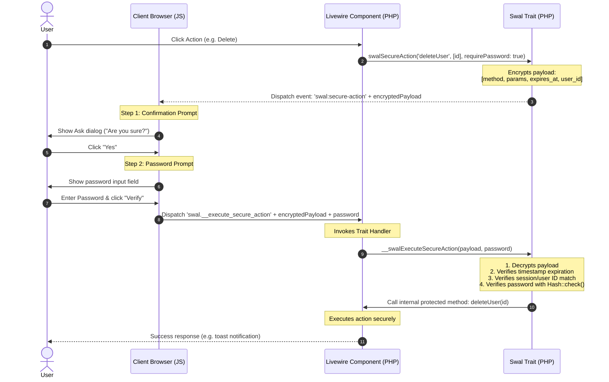

# Laravel & Livewire 3+ SweetAlert2 Helper Documentation

Welcome to the official developer documentation for the **Laravel & Livewire 3+ SweetAlert2 Helper** package. This documentation covers the architecture, setup choices, configuration options, helper API reference, and the cryptographically secured execution flow.

---

## 1. Architecture Overview

This package acts as a bridge between server-side Livewire components and client-side SweetAlert2 dialogs. It operates in two modes:
1. **Zero-Configuration Mode**: Automatically injects SweetAlert2 CDN and wrapper JS into HTML responses, bypassing the need for NPM or Vite build steps.
2. **Bundled Asset Mode**: Publishes assets for integration directly into Vite/Laravel Mix compiler chains.

### Secure Action Flow Diagram
The sequence diagram below shows how the cryptographically signed `swalSecureAction` prevents client-side bypasses by executing actions internally on the server after sequential client verification steps.



---

## 2. Setup Guide

Choose the configuration that matches your application architecture:

### Option A: Zero-Configuration (Default)
Ideal for rapid prototyping or applications where you want SweetAlert2 to work instantly without build steps.

1. **Install package**:
   ```bash
   composer require tuhin-su/laravel-generic-swal
   ```
2. **Import Trait**: Import `LaravelGenericSwal\Traits\Swal` directly into your Livewire component classes.
   *The SweetAlert2 jsDelivr CDN and wrappers are automatically appended to the closing `</body>` tag of your templates.*

---

### Option B: Bundled Asset Compilation (NPM + Vite)
Ideal for production applications where you want to host assets locally, bundle SweetAlert2 inside your JS build, or customize the Javascript wrapper.

1. **Install package**:
   ```bash
   composer require tuhin-su/laravel-generic-swal
   ```
2. **Publish resources**:
   ```bash
   php artisan vendor:publish --tag=laravel-generic-swal-config
   php artisan vendor:publish --tag=laravel-generic-swal-assets
   ```
3. **Configure Auto-injection**: Set `auto_inject` to `false` in `config/laravel-generic-swal.php` to prevent CDN injection:
   ```php
   'auto_inject' => false,
   ```
4. **Install SweetAlert2**:
   ```bash
   npm install sweetalert2
   ```
5. **Import wrapper**: In your Vite entry point `resources/js/app.js`:
   ```javascript
   import Swal from 'sweetalert2'
   window.Swal = Swal
   import './vendor/laravel-generic-swal/swal'
   ```

---

## 3. Configuration Reference

Publish the configuration file using `php artisan vendor:publish --tag=laravel-generic-swal-config`.

| Key | Type | Default | Description |
| :--- | :--- | :--- | :--- |
| `auto_inject` | `bool` | `true` | Toggles automatic injection of assets via the web middleware. |
| `swal_cdn` | `string\|false\|null` | `'https://cdn.jsdelivr.net/...'` | Script source for SweetAlert2. Use a custom CDN, set to a local asset path, or set to `false`/`null` if SweetAlert2 is loaded separately. |

---

## 4. PHP Helper API

All PHP helper methods are provided by importing the `LaravelGenericSwal\Traits\Swal` trait in your Livewire components.

### Toast Notifications (Small, Top-End)
```php
protected function swalToastSuccess(string $title = 'Success', string $text = '', array $opts = []): void
protected function swalToastWarning(string $title = 'Warning', string $text = '', array $opts = []): void
protected function swalToastError(string $title = 'Error', string $text = '', array $opts = []): void
```
- **$opts**: Accepts custom SweetAlert2 configuration options (e.g. `['timer' => 5000]`).

### Modal Dialogs (Larger Center Modals)
```php
protected function swalFireSuccess(string $title = 'Success', string $text = '', array $opts = []): void
protected function swalFireWarning(string $title = 'Warning', string $text = '', array $opts = []): void
protected function swalFireError(string $title = 'Error', string $text = '', array $opts = []): void
```

### Confirmation Prompt (Event-Driven)
```php
protected function swalConfirm(
    string $title = 'Are you sure?',
    string $text = '',
    array $opts = [],
    ?string $thenEvent = null,
    array $thenParams = [],
    ?string $thenEventTo = null
): void
```
- **$thenEvent**: The Livewire event name dispatched upon user acceptance.
- **$thenParams**: Payload parameters attached to the dispatched event.
- **$thenEventTo**: (Optional) Specific Livewire component name to target.

### User Input Prompts (Event-Driven)
```php
protected function swalTakeInput(
    string $title = 'Enter a value',
    string $text = '',
    string $input = 'text',
    array $opts = [],
    ?string $thenEvent = null,
    array $thenParams = [],
    ?string $thenEventTo = null
): void
```
- **$input**: SweetAlert2 input type (e.g. `'text'`, `'email'`, `'textarea'`, `'select'`).
- The entered value is received by the event listener in `$payload['value']`.

---

## 5. Security & Bypass Prevention Guide

For critical operations (such as user deletion, setting changes, or financial transfers), **never use event-driven confirmations like `swalConfirm`**, because client-side event dispatching can be easily bypassed by invoking `Livewire.dispatch()` via the browser developer console.

Instead, use **`swalSecureAction()`**.

### How swalSecureAction Works:
1. **Server-side Signature**: The server encrypts the parameters and target method name using your application's `APP_KEY`. This payload is signed and bound to the current user's session, timestamp, and component name.
2. **Sequential Verification**: The client browser displays confirmation dialogs and prompts for the password. The actual method is not yet executed.
3. **Internal Decryption**: The client sends the encrypted payload and password back. The server decrypts the payload, validates the session, confirms that the action has not expired, checks the password using `Hash::check()`, and dynamically executes the method.

### Code Pattern Example

Define your execution method as `protected` or `private`. Since Livewire only exposes `public` methods, clients cannot invoke it directly.

```php
use LaravelGenericSwal\Traits\Swal;
use Livewire\Component;

class SettingsComponent extends Component
{
    use Swal;

    // 1. The public entrypoint called by clicking the button
    public function initiateTransfer($accountId, $amount)
    {
        $this->swalSecureAction(
            method: 'processTransfer',
            params: ['to' => $accountId, 'amount' => $amount],
            requirePassword: true,
            confirmTitle: 'Confirm Fund Transfer?',
            confirmText: "You are about to transfer ${$amount} to Account #{$accountId}.",
            passwordTitle: 'Password Verification Required'
        );
    }

    // 2. The protected execution handler (safe from client-side console bypasses)
    protected function processTransfer(string $to, float $amount)
    {
        // Execute financial transaction safely...
        
        $this->swalToastSuccess('Transfer Complete', "Transferred ${$amount} successfully.");
    }
}
```

### Direct JS Trigger Option

You can generate the token on the server-side, render it into your template, and trigger the multi-step prompts directly in JavaScript via the `window.swalExecuteSecureAction(payload, requirePassword, options)` helper.

#### Component Method:
```php
public function render()
{
    $token = $this->swalGenerateSecureActionPayload('processTransfer', ['to' => '123', 'amount' => 100], true);
    return view('livewire.settings', ['token' => $token]);
}
```

#### Template Button:
```html
<button onclick="window.swalExecuteSecureAction('{{ $token }}', true, {
    confirmTitle: 'Confirm Transfer?',
    confirmText: 'This will authorize the transfer.',
    passwordTitle: 'Verification Required'
})">
    Transfer Funds
</button>
```
